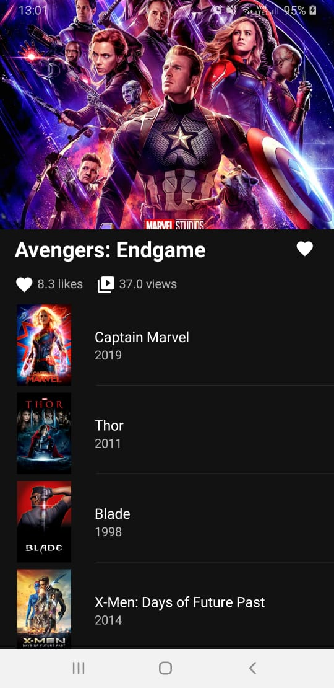
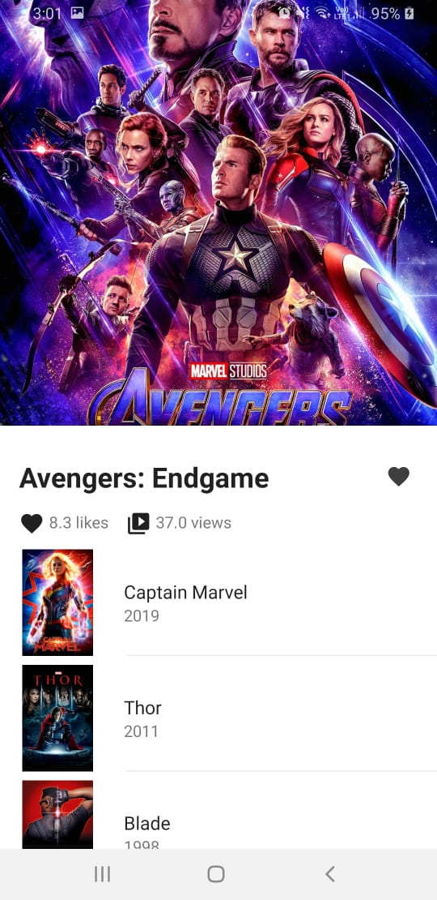

# Moovi
Moovi is an mini app that shows data from movies provided by Movies DB

Using material design library and automatically changes to dark mode
>to see app with working darkmode clone branch [darkmode](https://github.com/CaioProgramming/Moovi/tree/darkmode)

# Dark Mode

# Light Mode

